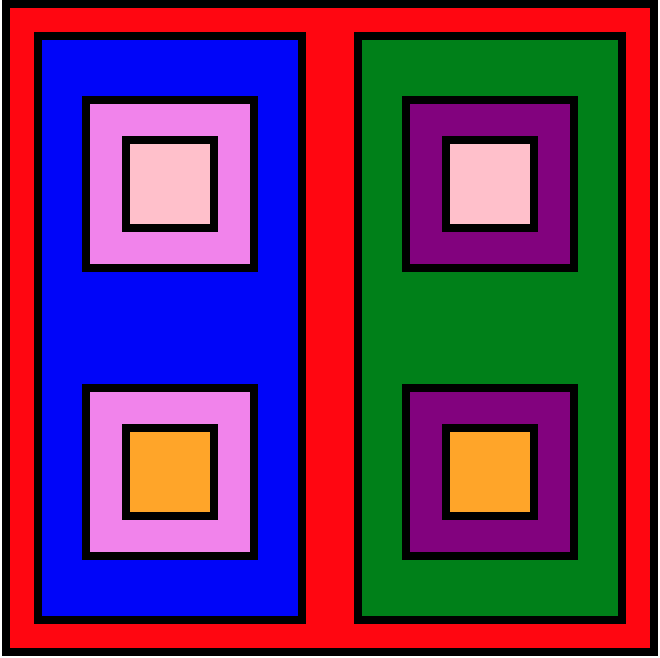

# Introdução ao desenvolvimento web / bloco 5 / dia 1

# Exercício GetElementById (getByid.html)

```
<!DOCTYPE html>
<html>
  <body>
    <h2 id="page-title">Título</h2>
    <p id="paragraph">Dê uma cor para este parágrafo!</p>
    <h4 id="subtitle">Subtítulo</h4>
    <p id="second-paragraph">Segundo parágrafo!</p>

    <script>
      var paragraph = document.getElementById("paragraph");
      paragraph.style.color = "red";
    </script>
  </body>
</html>

```
###

Agora você! Faça o seguinte:

1. Recupere o elemento que contém o título da página e faça algo com ele, como alterá-lo para o nome do seu filme favorito.
2. Agora recupere o segundo parágrafo e use sua criatividade para alterá-lo.
3. Por fim, recupere o subtítulo e altere-o também

###

# Exercício GetElementsByClassName (getByClass.html e scripts.js)

1. Adicione ao seu HTML uma classe com alguns estilos para os seus dois parágrafos.
2. Recupere os seus parágrafos via código JavaScript, usando a função getElementsByClassName;
3. Altere algum estilo do primeiro deles.
Recupere o subtítulo pela tag.

###

# Exercício Retângulos (retangulo.html)

Coloque a cor dos retângulos como na cor desta imagem abaixo usando apenas o JavaScript!



###

# Funções de manipulação do DOM

É hora de aplicar seus conhecimentos em manipular os elementos do HTML!

1. A seguir, você verá um trecho de código HTML e CSS.
2. Crie um arquivo HTML dentro do diretório exercises/5_1 e copie o código a seguir.
3. Leia as instruções que estão dentro de um comentário na tag <script>.
4. Não se esqueça de fazer um commit a cada exercício!

```
<!DOCTYPE html>
<html>
  <head>
    <meta charset="UTF-8" />
    <meta name="viewport" content="width=device-width" />
    <title>Exercício 5.1</title>

    <style>
      div {
        border-color: black;
        border-style: solid;
      }
      .title {
        text-align: center;
      }

      .main-content {
        background-color: yellow;
      }

      .main-content .center-content {
        background-color: red;
        width: 50%;
        margin: 0 auto;
      }

      .main-content .center-content p {
        font-style: italic;
      }
    </style>
  </head>
  <body>
    <h1 class="title">Exercício 5.1 - JavaEscripito </h1>
    <div class="main-content">
      <div class="center-content">
        <p>Texto padrão do nosso site</p>
        <p>-----</p>
        <p>Trybe</p>
      </div>
    </div>
    <script>
        /*
        Aqui você vai modificar os elementos já existentes utilizando apenas as funções:
        - document.getElementById()
        - document.getElementsByClassName()
        - document.getElementsByTagName()
 Crie uma função que mude o texto na tag <p> para uma descrição de como você se vê daqui a 2 anos. (Não gaste tempo pensando no texto e sim realizando o exercício)
 Crie uma função que mude a cor do quadrado amarelo para o verde da Trybe (rgb(76,164,109)).
 Crie uma função que mude a cor do quadrado vermelho para branco.
 Crie uma função que corrija o texto da tag <h1>.
 Crie uma função que modifique todo o texto da tag <p> para maiúsculo.
 Crie uma função que exiba o conteúdo de todas as tags <p> no console.
        */
    </script>
  </body>
</html>

```


